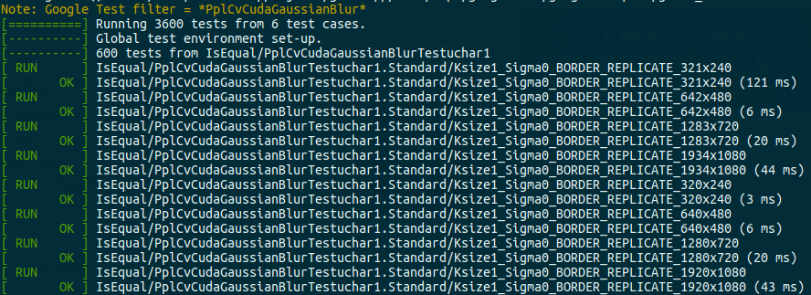
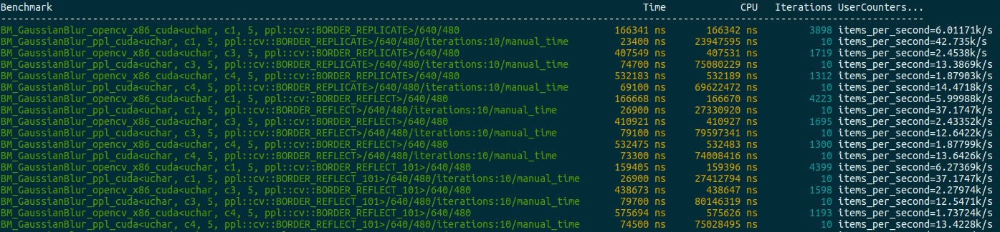

## CUDA Platform Guide

### 1. Building commands on linux

If you just want ppl.cv binary libary to link, then run the following command in the root directory of ppl.cv.

`$ ./build.sh cuda`

This builds the ppl.cv static library, and packages the header files, the binary library and other relevant files together for usage. The generated directories and files look something like this:

```
ppl.cv/cuda-build/install/
  bin/
  include/ppl/cv/cuda/
    abs.h
    ...
  lib/
    libpplcv_static.a
    ...
  share/
```

If what you want to build includes not only the static library but also the executable unit test and benchmark, then run the following command in the root directory of ppl.cv.

`$ ./build.sh cuda -DHPCC_USE_X86_64=ON -DPPLCV_BUILD_TESTS=ON -DPPLCV_BUILD_BENCHMARK=ON`

Besides the static library, the executable program files of ppl.cv unittest and benchmark will be generated and the location looks like this:

```
ppl.cv/cuda-build/bin/
  pplcv_benchmark
  pplcv_unittest
```


### 2. Building commands on windows

Similar to compiling and linking on linux, script and commands to invoke Microsoft Visual Studio are used to build ppl.cv. For now, "Visual Studio 2015" and "Visual Studio 2019" are supported and tested. If you just want ppl.cv binary libary to link, then run the following command in the root directory of ppl.cv.

`$ ./build.bat -G "Visual Studio 14 2015 Win64" -DHPCC_USE_CUDA=ON`

`$ ./build.bat -G "Visual Studio 16 2019" -A x64 -DHPCC_USE_CUDA=ON`

The generated directories and files look something like this:

```
ppl.cv/cuda-build/install/
  etc/
  include/ppl/cv/cuda/
    abs.h
    ...
  lib/
    libpplcv_static.lib
    ...
  x64/
```

If what you want to build includes not only the static library but also the executable unit test and benchmark, then run the following command in the root directory of ppl.cv.

`$ ./build.bat -G "Visual Studio 14 2015 Win64" -DHPCC_USE_X86_64=ON -DHPCC_USE_CUDA=ON -DPPLCV_BUILD_TESTS=ON -DPPLCV_BUILD_BENCHMARK=ON`

`$ ./build.bat -G "Visual Studio 16 2019" -A x64 -DHPCC_USE_X86_64=ON -DHPCC_USE_CUDA=ON -DPPLCV_BUILD_TESTS=ON -DPPLCV_BUILD_BENCHMARK=ON`

Besides directories of the header files and the static library, the executable unittest and benchmark are located as:

```
ppl.cv/cuda-build/bin/Release/
  pplcv_benchmark.exe
  pplcv_unittest.exe
  ...
```


### 3. How to run unittest

The executable unittest includes unit tests for all functions on all platforms, which check the consistency between the implementation in ppl.cv and that in opencv of functions. Our unittest is based on GoogleTest, and use regular expression to identify function unit tests. To run all the unit tests of all function in ppl.cv.cuda, the following commands is needed:

`$ ./pplcv_unittest --gtest_filter=*PplCvCuda*`

To run the unit test of a particular function, a regular express consisting of 'PplCvCuda' and the function name is needed. For example, the command to run the unit test of GaussianBlur() is as following:

`$ ./pplcv_unittest --gtest_filter=*PplCvCudaGaussianBlur*`

The output of a unit test case is formatted with the arguments passed to its function, So each test case shows both the execution status and the function arguments. When a case fails, the input arguments of the function can be easily determined.




### 4. How to run benchmark

The executable benchmark exhibits performance of all ppl.cv functions on all platforms, also shows performance comparison between the implementation in ppl.cv and that in opencv x86 and opencv cuda. Our benchmark is based on Google Benchmark, and use regular expression to identify functions. To run all benchmarks of all function in ppl.cv.cuda, the following commands is needed:

`$ ./pplcv_benchmark --benchmark_filter="BM_.+cuda"`

To run the benchmark of a particular function, a regular express consisting of 'BM_.+cuda' and the function name is needed. For example, the command to run the benchmark of GaussianBlur() is as following:

`$ ./pplcv_benchmark --benchmark_filter="BM_GaussianBlur.+cuda"`

The output of a benchmark is also formatted with the arguments passed to its function, So each benchmark case shows both the execution time and the function arguments. Since manual timing is adopted for GPU in Google Benchmark, so the *Time* column is the real time of function execution on GPU.




### 5. Library customization and tailoring

ppl.cv targets small volume and flexibility. Each function normally has four files, including a *.h file for function declaration and document, a *.cu file for function implementation, a *_unittest.cpp file for unit test and a *_benchmark.cpp file for performance exhibition. Besides very limited invocation between functions, there is not dependency between functions. In 'ppl/cv/src/ppl/cv/cuda/utility' folder, function utility, cuda memory pool, unit test infrastructure and performance benchmark infrastructure are defined for each function. In order to create a customized cuda cv library from ppl.cv.cuda, the utility files and the files of needed functions are just needed to be kept.

For example, a customization library, which only has Adaptivethreshold(), has the following files.

```
ppl/cv/
  include/ppl/cv/cuda/
    adaptivethreshold.h
    use_memory_pool.h
  src/ppl/cv/cuda/
    adaptivethreshold.cu
    adaptivethreshold_unittest.cpp
    adaptivethreshold_benchmark.cpp
    utility/
      (all files under this directory)
  ...

```
