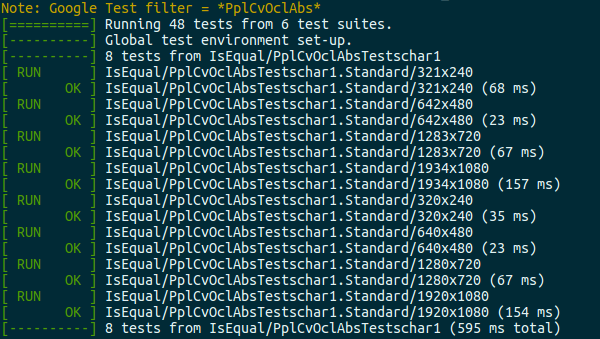
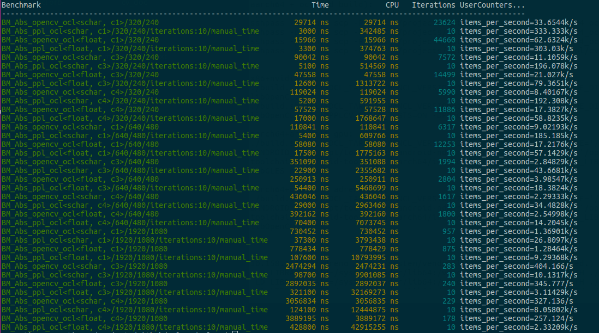

## OpenCL Platform Guide

### 1. Prerequisites

* Ubuntu >= 16.04
* OpenCL >= 1.2
* gcc/g++ >= 4.9
* cmake >= 3.14
* Git >= 2.7.0

### 2. OpenCL kernel compilation using ppl.common.ocl

*ppl.cv.ocl* use kernels compilation infrastructure provided by ppl.common.ocl to speed up kernel compilation during programs execution. These infrastructures include a binary kernel pool, OpenCL frame chain management and an executable querying supported OpenCL properties on hardware. The first caches each compiled binary kernel in a kernel pool when kernel compilation is invoked to eliminate repeated compilation when the kernel will be used again. This works transparently, without user intervention. The second speeds up kernel compilation by managing OpenCL platform, device, context, command queue, program, kerenl, etc. This serves in 2 ways as illustrated in the following code snippet. One uses the command queue passed by user, and the other uses a shared frame chain including a command queue and cached other OpenCL components, and is suggested. The third can be used to query what OpenCL properties are supported on the target GPU before OpenCL application development. The executable is named as oclgpuinfo, and located in ppl.cv/x86_ocl-build(/aarch64_ocl-build)/bin/ after compilation.

```
  ppl::common::ocl::FrameChain frame_chain(queue);
  cl_command_queue queue = frame_chain.getQueue();
  ppl::cv::ocl::Abs(queue, ...);

```

```
  ppl::common::ocl::createSharedFrameChain(false);
  cl_command_queue queue = ppl::common::ocl::getSharedFrameChain()->getQueue();
  ppl::cv::ocl::Abs(queue, ...);
```

### 3. How to build from source on linux

*ppl.cv.ocl* supports x86_64 linux and aarch64 android OSs, and is configured and tested on nvidia/qualcomm adreno/arm mali GPUs. Since it uses standard OpenCL grammar, it can be configured and runs on other GPUs supporting OpenCL, such as intel/amd gpu in theory. To configure and run the compilation command, the OpenCL version, the directory of OpenCL headers, the directory of OpenCL libraries, the android ndk and the tool chain for cross compilation must be specified. Here is 3 command examples needed to be run in the root directory of *ppl.cv* to generate *ppl.cv* binary libary for nvidia/qualcomm adreno/arm mali GPUs separately.

`$ ./build.sh ocl -DCL_TARGET_OPENCL_VERSION=120 -DPPLCV_OPENCL_INCLUDE_DIRS='/usr/include' -DPPLCV_OPENCL_LIBRARIES='/usr/local/cuda-10.0/lib64/libOpenCL.so'`

`$ ./build.sh ocl -DCL_TARGET_OPENCL_VERSION=220 -DCMAKE_TOOLCHAIN_FILE='/opt/toolchains/android-ndk-r24/build/cmake/android.toolchain.cmake' -DANDROID_NDK='/opt/toolchains/android-ndk-r24' -DCMAKE_ANDROID_NDK='/opt/toolchains/android-ndk-r24' -DPPLCV_OPENCL_INCLUDE_DIRS='/opt/toolchains/android-toolchain-aarch64/include/OpenCL' -DPPLCV_OPENCL_LIBRARIES='/opt/toolchains/android-toolchain-aarch64/lib64/OpenCL/qualcomm/libOpenCL.so'`

`$ ./build.sh ocl -DCL_TARGET_OPENCL_VERSION=220 -DCMAKE_TOOLCHAIN_FILE='/opt/toolchains/android-ndk-r24/build/cmake/android.toolchain.cmake' -DANDROID_NDK='/opt/toolchains/android-ndk-r24' -DCMAKE_ANDROID_NDK='/opt/toolchains/android-ndk-r24' -DPPLCV_OPENCL_INCLUDE_DIRS='/opt/toolchains/android-toolchain-aarch64/include/OpenCL' -DPPLCV_OPENCL_LIBRARIES='/opt/toolchains/android-toolchain-aarch64/lib64/OpenCL/mali/t860/libGLES_mali.so'`

These commands build the *ppl.cv* static library, and package the header files, the binary library and other relevant files together for usage. The generated directories and files look something like this:

```
ppl.cv/x86_ocl-build(/aarch64_ocl-build)/install/
  include/ppl/cv/ocl/
    abs.h
    ...
  lib/
    libpplcv_static.a
    ...
```

If what you want to build includes not only the static library but also the executable unit test and benchmark, then run the following command in the root directory of *ppl.cv*.

`$ ./build.sh ocl -DCL_TARGET_OPENCL_VERSION=120 -DPPLCV_OPENCL_INCLUDE_DIRS='/usr/include' -DPPLCV_OPENCL_LIBRARIES='/usr/local/cuda-10.0/lib64/libOpenCL.so' -DPPLCV_BUILD_TESTS=ON -DPPLCV_BUILD_BENCHMARK=ON`

`$ ./build.sh ocl -DCL_TARGET_OPENCL_VERSION=220 -DCMAKE_TOOLCHAIN_FILE='/opt/toolchains/android-ndk-r24/build/cmake/android.toolchain.cmake' -DANDROID_NDK='/opt/toolchains/android-ndk-r24' -DCMAKE_ANDROID_NDK='/opt/toolchains/android-ndk-r24' -DPPLCV_OPENCL_INCLUDE_DIRS='/opt/toolchains/android-toolchain-aarch64/include/OpenCL' -DPPLCV_OPENCL_LIBRARIES='/opt/toolchains/android-toolchain-aarch64/lib64/OpenCL/qualcomm/libOpenCL.so' -DPPLCV_BUILD_TESTS=ON -DPPLCV_BUILD_BENCHMARK=ON`

`$ ./build.sh ocl -DCL_TARGET_OPENCL_VERSION=220 -DCMAKE_TOOLCHAIN_FILE='/opt/toolchains/android-ndk-r24/build/cmake/android.toolchain.cmake' -DANDROID_NDK='/opt/toolchains/android-ndk-r24' -DCMAKE_ANDROID_NDK='/opt/toolchains/android-ndk-r24' -DPPLCV_OPENCL_INCLUDE_DIRS='/opt/toolchains/android-toolchain-aarch64/include/OpenCL' -DPPLCV_OPENCL_LIBRARIES='/opt/toolchains/android-toolchain-aarch64/lib64/OpenCL/mali/t860/libGLES_mali.so' -DPPLCV_BUILD_TESTS=ON -DPPLCV_BUILD_BENCHMARK=ON`

Besides the static library, the executable program files of *ppl.cv* unittest and benchmark will be generated and the location looks like this:

```
ppl.cv/x86_ocl-build(/aarch64_ocl-build)/bin/
  pplcv_benchmark
  pplcv_unittest
  oclgpuinfo
```

### 4. How to run unittest

The executable unittest includes unit tests for all functions on all platforms, which check the consistency between the implementation in *ppl.cv* and that in opencv opencv x86/aarch64. Our unittest is based on GoogleTest, and use regular expression to identify function unit tests. To run all the unit tests of all function in *ppl.cv.ocl*, the following commands is needed:

`$ ./pplcv_unittest --gtest_filter=*PplCvOcl*`

To run the unit test of a particular function, a regular express consisting of 'PplCvOcl' and the function name is needed. For example, the command to run the unit test of Abs() is as following:

`$ ./pplcv_unittest --gtest_filter=*PplCvOclAbs*`

The output of a unit test case is formatted with the arguments passed to its function, So each test case shows both the execution status and the function arguments. When a case fails, the input arguments of the function can be easily determined.



### 5. How to run benchmark

The executable benchmark exhibits performance of all *ppl.cv* functions on all platforms, also shows performance comparison between the implementation in *ppl.cv* and that in opencv x86/aarch64. Our benchmark is based on Google Benchmark, and use regular expression to identify functions. To run all benchmarks of all function in *ppl.cv.ocl*, the following commands is needed:

`$ ./pplcv_benchmark --benchmark_filter="BM_.+ocl"`

To run the benchmark of a particular function, a regular express consisting of 'BM_.+ocl' and the function name is needed. For example, the command to run the benchmark of Abs() is as following:

`$ ./pplcv_benchmark --benchmark_filter="BM_Abs.+ocl"`

The output of a benchmark is also formatted with the arguments passed to its function, So each benchmark case shows both the execution time and the function arguments. Since manual timing is adopted for GPU in Google Benchmark, so the *Time* column is the real time of function execution on GPU.



### 6. How to use a function

There is a brief document coming with the interface in `include/ppl/cv/ocl/xxx.h` for each function. What it does, supported data types, supported channels, introduction of parameters, return value and other notices are provided. A example code snippet is also offered to show how to invoke this function in your application. Please refer to its document before you use a function.

### 7. How to add a function

There are some conventions made by the cmake building system of *ppl.cv* that should be abided by when a new function is added. There are at least five files for a function definition as listed below where their file names have a common prefix(xxx).

* include/ppl/cv/ocl/xxx.h: A prototype declaration and a brief introduction of the interface and usage example should be given here.
* src/ppl/cv/ocl/xxx.cl: Kernel definitions, device function definitions and macros used by kernels should be located here. A kernel is identified by its name and corresponding C preprocessing macro when it is compiled.
* src/ppl/cv/ocl/xxx.cpp: Host function definitions, thread confuration and kernel invocation and other definitions used by host functions should be located here. The kernel definition file must be included in the form of `#include "kernels/xxx.cl"` in this file.
* src/ppl/cv/ocl/xxx_unittest.cpp: An unittest based on *GoogleTest* covering thorough parameter combination in usage cases should be provided here to compare the outputs with its counterpart in *OpenCV* for consistency.
* src/ppl/cv/ocl/xxx_benchmark.cpp: A benchmark based on *Google Benchmark* covering common usage cases should be provided here to compare performance with its counterpart in *OpenCV* to validate the implemented optimization.

Some common infrastructure in *ppl.cv* can facilitate development. Firstly, some enumerations for image processing algorithm are given in `include/ppl/cv/types.h`, and can be used in the interface and host functions of a function. Secondly, error checking, type definitions and enumerations and inline functions of thread configuration are provided in `src/ppl/cv/ocl/utility/utility.hpp` and can be used in host functions. Thirdly, macros and device functions used by kernels are provided in `src/ppl/cv/ocl/kerneltypes.h` which should be included in `src/ppl/cv/ocl/xxx.cl` when needed. Fourthly, infrastructures for creating different input images and checking consistency in unittest/benchmark are provided in `src/ppl/cv/ocl/utility/infrastructure.h(infrastructure.cpp)`, and can be used in writing a unittest/benchmark.

### 8. How to customize this library

*ppl.cv.ocl* targets small volume and flexibility. Each function normally has five files, including a xxx.h file for function declaration and document, a xxx.cpp file for function implementation, a xxx.cl file for kernel definition, a xxx_unittest.cpp file for unit test and a xxx_benchmark.cpp file for performance exhibition. Besides very limited invocation between functions, there is not dependency between functions. In 'ppl/cv/src/ppl/cv/ocl/utility' folder, function utility, unit test infrastructure and performance benchmark infrastructure are defined for each function. In order to create a customized OpenCL cv library from *ppl.cv.ocl*, the utility files and the files of needed functions are just needed to be kept.

For example, a customization library, which only has CopyMakeBorder(), has the following files.

```
ppl/cv/
  include/ppl/cv/ocl/
    copymakeborder.h
  src/ppl/cv/ocl/
    copymakeborder.cpp
    copymakeborder.cl
    copymakeborder_unittest.cpp
    copymakeborder_benchmark.cpp
    utility/
      (all files under this directory)
  ...

```
