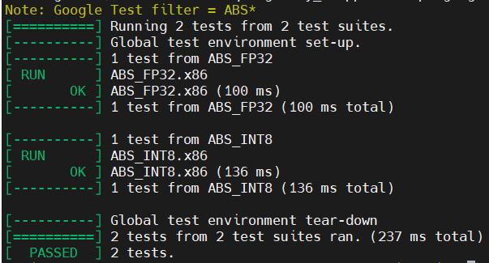
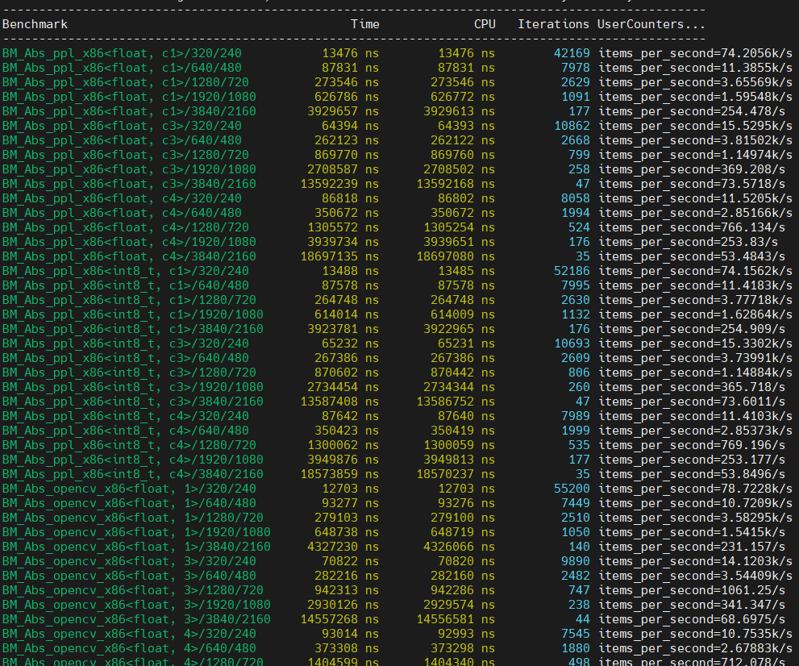

## x86 Platform Guide

### 1. Prerequisites

* Ubuntu >= 16.04
* gcc/g++ >= 7.5
* cmake >= 3.14
* Git >= 2.7.0


### 2. How to build from source on linux

There should be a x86 cpu and a c/c++ compiler installed in */usr/bin* on the machine where *ppl.cv.x86* is built and run. If you just want *ppl.cv.x86* binary libary to link, then run the following command in the root directory of *ppl.cv*.

`$ ./build.sh x86_64`

This builds the *ppl.cv.x86* static library, and packages the header files, the binary library and other relevant files together for usage. The generated directories and files look something like this:

```
ppl.cv/x86-64-build/install/
  include/ppl/cv/x86/
    abs.h
    ...
  lib/
    libpplcommon_static.a
    libpplcv_static.a
    ...
```

If what you want to build include not only the static library but also the executable unit test and benchmark, then run the following command in the root directory of *ppl.cv*.

`$ ./build.sh x86_64 -DPPLCV_BUILD_TESTS=ON -DPPLCV_BUILD_BENCHMARK=ON`

Besides the static library, the executable program files of *ppl.cv.x86* unittest and benchmark will be generated and the location looks like this:

```
ppl.cv/x86-64-build/bin/
  pplcv_benchmark
  pplcv_unittest
  cpuinfo
```

### 3. How to run unittest

The executable unittest includes unit tests for all functions on x86 platforms, which check the consistency between the implementation in *ppl.cv* and that in opencv of functions. Our unittest is based on GoogleTest, and use regular expression to identify function unit tests. To run all the unit tests of all function in *ppl.cv.x86*, the following commands is needed:

`$ ./pplcv_unittest --gtest_filter="standard*"`

`$ ./pplcv_unittest --gtest_filter="*.x86"`

To run the unit test of a particular function, a regular expression consisting of '*' and the function name is needed. And some functions may use a regular expression consisting of "standard/" and the function name.For example, the command to run the unit test of Abs() is as following:

`$ ./pplcv_unittest --gtest_filter="ABS*"`

The output of a unit test case is formatted with the arguments passed to its function, So each test case shows both the execution status and the function arguments. When a case fails, the input arguments of the function can be easily determined.




### 4. How to run benchmark

The executable benchmark exhibits performance of all *ppl.cv* functions on x86 platforms, also shows performance comparison between the implementation in *ppl.cv.x86* and that in opencv x86. Our benchmark is based on Google Benchmark, and use regular expression to identify functions. To run all benchmarks of all function in *ppl.cv.x86*, the following commands is needed:

`$ ./pplcv_benchmark --benchmark_filter="BM_.+x86"`

To run the benchmark of a particular function, a regular express consisting of 'BM_.+x86' and the function name is needed. For example, the command to run the benchmark of Abs() is as following:

`$ ./pplcv_benchmark --benchmark_filter="BM_Abs.+x86"`

The output of a benchmark is also formatted with the arguments passed to its function, So each benchmark case shows both the execution time and the function arguments.




### 5. How to use a function

There is a brief document coming with the interface in `include/ppl/cv/x86/xxx.h` for each function. What it does, supported data types, supported channels, introduction of parameters, return value and other notices are provided. A example code snippet is also offered to show how to invoke this function in your application. Please refer to its document before you use a function.


### 6. How to add a function

There are some conventions made by the cmake building system of *ppl.cv* that should be abided by when a new function is added. There are at least four files for a function definition as listed below where their file names have a common prefix(xxx).

* include/ppl/cv/x86/xxx.h: A prototype declaration and a brief introduction of the interface and usage example should be given here.
* src/ppl/cv/x86/xxx.cpp: All things about implementation, including macros, kernel definitions and function definitions, should be located here.
* src/ppl/cv/x86/xxx_unittest.cpp: An unittest based on *GoogleTest* covering thorough parameter combination in usage cases should be provided here to compare the outputs with its counterpart in *OpenCV* for consistency.
* src/ppl/cv/x86/xxx_benchmark.cpp: A benchmark based on *Google Benchmark* covering common usage cases should be provided here to compare performance with its counterpart in *OpenCV* to validate the implemented optimization.

Some common infrastructure in *ppl.cv* can facilitate development. Firstly, some enumerations for image processing algorithm are given in `include/ppl/cv/types.h`, and can be used in the interface and host functions of a function. Secondly, error checking, type definitions, enumerations and inline functions, which are shared by functions, are provided in `src/ppl/cv/x86/utility/utility.hpp` and can be used in functions. Thirdly, infrastructures for creating different input images and checking consistency in unittest/benchmark are provided in `src/ppl/cv/x86/utility/infrastructure.hpp`, and can be used in writing a unittest/benchmark.


### 7. How to customize this library

*ppl.cv* targets small volume and flexibility. Each function normally has four files, including a xxx.h file for function declaration and document, a xxx.cpp file for function implementation, a xxx_unittest.cpp file for unit test and a xxx_benchmark.cpp file for performance exhibition. Besides very limited invocation between functions, there is not dependency between functions. In 'ppl/cv/src/ppl/cv/x86/utility' folder, function utility, unit test infrastructure and performance benchmark infrastructure are defined for each function. In order to create a customized cv library from *ppl.cv.x86*, the utility files and the files of needed functions are just needed to be kept.

For example, a customization library, which only has CopyMakeBorder(), has the following files.

```
ppl/cv/
  include/ppl/cv/x86/
    copymakeborder.h
  src/ppl/cv/x86/
    copymakeborder.cpp
    copymakeborder_unittest.cpp
    copymakeborder_benchmark.cpp
    utility/
      (all files under this directory)
  ...

```
